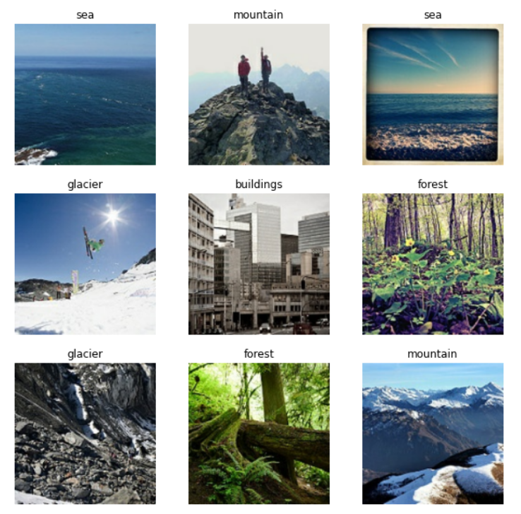
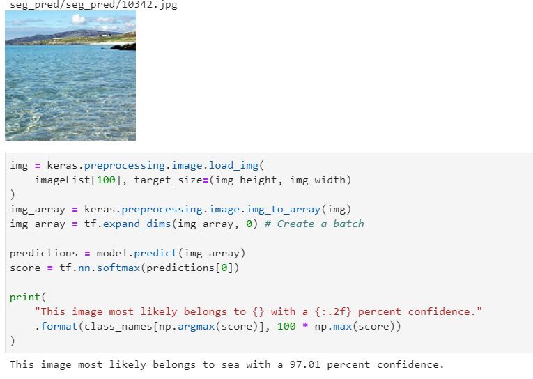

# Image-Classification-Using-TensorFlow

This Project creates an image classifier using a keras.Sequential model on a dataset of morethan 25k images of size 150x150 distributed under 6 categories.
Building,Forest,Sea,Street,Glacier,Mountain

This will follow a basic machine learning workflow:

Examine and understand data 
Build an input pipeline 
Build the model 
Train the model 
Test the model 
Improve the model and repeat the process 

Data : https://www.kaggle.com/puneet6060/intel-image-classification

Results   

